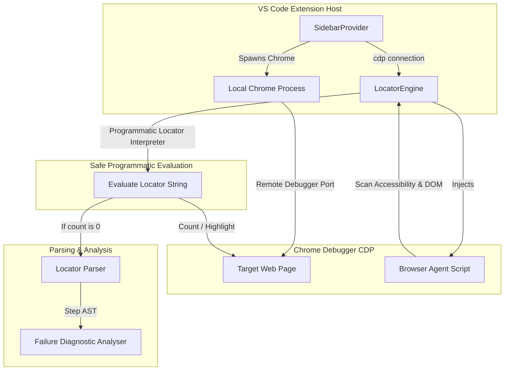
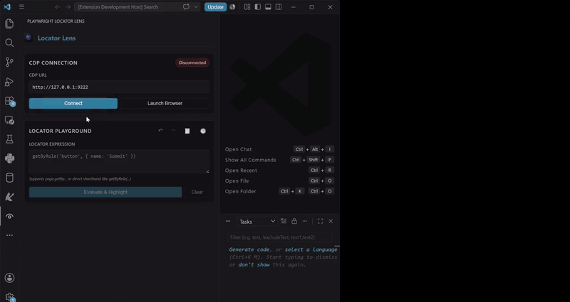

# Playwright Locator Lens 🔍

**Playwright Locator Lens** is a real-time locator validation, analysis, and UI scanning tool integrated directly into VS Code as a sidebar extension. It helps automation engineers instantly write, debug, and optimize complex Playwright locators against live web pages.

---

## 🚀 Key Features

* **Instant Locator Playground**: Type any Playwright locator and see matches highlighted immediately on the live browser tab.
* **Complex Chaining Evaluation**: Fully supports chaining filters, indexes, `.or()`, `.and()`, and `.filter()` operators.
* **Auto-Launched Debugging Browser**: Spin up Google Chrome in remote-debugging mode (`--remote-debugging-port`) directly from the extension sidebar—no command prompt required.
* **Smarter Match Navigation**: Traverse multiple matching elements seamlessly (e.g. `match 5 of 22`) while viewing metadata details focused specifically on the selected match.
* **Diagnostics & Alternatives**:
  - Shows alternative recommended selectors sorted by **confidence score**.
  - Diagnoses failing locators step-by-step to point out where the chain broke (e.g. invalid text, missing label, wrong role).
* **UI Scanner & Accessibility Audit (Beta)**:
  - Generate full Semantic UI Trees.
  - Run accessibility checks on elements (missing labels, dynamic IDs, duplicate descriptors).
  - Export structures to Page Object Models (POM) or SDK wrappers.

---

## 🔗 Supported Locators & Chaining

Playwright Locator Lens supports evaluating the full spectrum of Playwright selectors, including:

### 1. Core Locators
* `page.locator(selector)` (CSS or XPath)
* `page.getByRole(role, options)`
* `page.getByLabel(text, options)`
* `page.getByPlaceholder(text, options)`
* `page.getByText(text, options)`
* `page.getByAltText(text, options)`
* `page.getByTitle(text, options)`
* `page.getByTestId(id)`

### 2. Complex Chaining & Filtering
You can connect and chain operators to narrow down targets:
* **Chaining Locators**: `page.locator('form').locator('input')`
* **Filtering by Text**: `page.locator('tr').filter({ hasText: 'John Doe' })`
* **Filtering by Nested Element**: `page.locator('div').filter({ has: page.locator('span.badge') })`
* **Logical OR Combinations**: `page.locator('button.submit').or(page.locator('input[type="submit"]'))`
* **Logical AND Combinations**: `page.locator('input').and(page.locator('[required]'))`
* **Index Traversals**: `.first()`, `.last()`, `.nth(index)`

---

## 🏗️ Architecture Overview

The project is structured as a multi-package Monorepo utilizing NPM Workspaces:

```
PlaywrightLocatorLens/
├── packages/
│   ├── extension/          # VS Code extension runner & sidebar Webview UI
│   ├── engine/             # Sandbox execution engine & diagnostic analyzer
│   ├── locator-parser/     # Custom tokenizer and AST parser for locator strings
│   ├── browser-agent/      # Client-side agent script injected into the web page
│   └── shared/             # Common TypeScript typings and interfaces
└── README.md
```



### 1. Extension (`packages/extension`)
Acts as the bridge between VS Code and the browser.
* Spawns Chrome with flags: `--remote-debugging-port=9222`, `--user-data-dir=.vscode/playwright-locator-profile/`.
* Manages the Sidebar Webview panel (`index.html` + `main.js`), rendering query boxes, match highlights, details, copy controls, and beta toggles.

### 2. Engine (`packages/engine`)
Handles execution safety and diagnostics.
* Safely parses and programmatically evaluates locator expressions step-by-step using a secure method whitelist (e.g. `getByRole`, `locator`, `filter`), completely eliminating `eval` or Node `vm.runInContext` sandbox escape exploits.
* Conducts **Failure Diagnostics** by splitting query paths into steps, evaluating them incrementally, and identifying the precise node where a query yields zero elements.

### 3. Parser (`packages/locator-parser`)
A custom lexical tokenizer and recursive descent parser.
* Tokenizes the locator string into identifier/string/regex tokens.
* Builds a step-by-step AST array representing the chain (e.g. `[{ name: 'locator', args: ['div'] }, { name: 'or', args: [...] }]`).
* Provides stringification utilities to reconstruct sub-locators for diagnostics.

### 4. Browser Agent (`packages/browser-agent`)
A client-side script injected into the target browser frame.
* Operates inside the browser to query CSS bounding rects, generate overlays for highlights, and analyze semantic tags.
* Conducts Accessibility Audits, computing Automation Readiness scores.

### 5. Shared (`packages/shared`)
Declares TypeScript interfaces (e.g. `EvaluationResult`, `ElementDetails`, `UiNode`) shared across the frontend webview, extension host, engine, and agent.

---

## 🛠️ Configuration Settings

Configure settings inside VS Code (`settings.json`):
* `playwright-locator-lens.browserPath`: Specific path to Google Chrome (defaults to auto-detect).
* `playwright-locator-lens.debuggingPort`: CDP port (default: `9222`).
* `playwright-locator-lens.enableBetaFeatures`: Toggle (default: `false`) to display advanced actions like Stability Testing, Action Simulation, and POM Code Export.
* `playwright-locator-lens.cleanBrowserProfile`: Toggle (default: `false`) to clean up the temporary Chrome profile folder upon exit.

## 🎬 Demonstration Video

Below is a recording showing Playwright locators highlighting matching elements:



[▶ Watch Video](./PlaywrightLocatorLens_Demo_30s.mp4)
